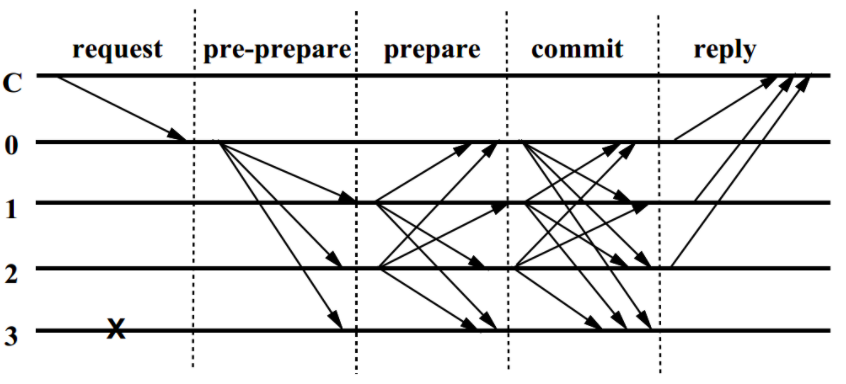

### Abstract
This post provides a brief overview of the state-of-art consensus algorithm.
<!-- more -->
## 1. Consistency and Consensus

### 1.1 Consistency Problem
Given a distributed system (a set of connected nodes) and a series of operations, e.g. R/W,
if the system always returns the identical result no matter which nodes performs these operations, we call this system achieve consistency.

<!-- 在分布式系统中，一致性是指对于系统中的多个服务节点，给定一系列操作，在协议（往往通过某种共识算法）保障下，试图使得它们对处理结果达成某种程度的一致。
如果分布式系统能实现“一致”，对外就可以呈现为一个功能正常的，且性能和稳定性都要好很多的“虚处理节点”。
所謂一致性，是指對於分散式系統中的多個節點，給定一系列操作，在約定協議的保障下，它們對處理結果達成認同。分佈式環境裡要求多點資料是一致的，即資料要完整、要同步。 原文網址：https://itw01.com/IKT3ERF.html -->


In reality, the distributed system is vulnerable because of
- unreliable network
- unstable nodes
- synchronous may increase the consistency but harm the system scalability.

<!-- 在实际的计算机集群系统（看似强大的计算机系统，很多地方都比人类世界要脆弱的多）中，存在如下的问题：
- 节点之间的网络通讯是不可靠的，包括任意延迟和内容故障；
- 节点的处理可能是错误的，甚至节点自身随时可能宕机；
- 同步调用会让系统变得不具备可扩展性。
-->


An ideal distributed system achieving consistency follows :
- Termination: complete a series of operations and return the same result within a given time period.
- Agreement: the operations performed by or the decision chosen by different nodes must be identical.
- Validity: the operations performed by or the decision chosen by different nodes must have been proposed by some process.

<!-- 规范的说，理想的分布式系统一致性应该满足：
可终止性（Termination）：一致的结果在有限时间内能完成；
Agreement：不同节点最终完成决策的结果应该相同；
合法性（Validity）：决策的结果必须是其它进程提出的提案。
第一点很容易理解，这是计算机系统可以被使用的前提。需要注意，在现实生活中这点并不是总能得到保障的，例如取款机有时候会是“服务中断”状态，
电话有时候是“无法连通”的。
第二点看似容易，但是隐藏了一些潜在信息。算法考虑的是任意的情形，凡事一旦推广到任意情形，就往往有一些惊人的结果。例如现在就剩一张票了，
中关村和西单的电影院也分别刚确认过这张票的存在，然后两个电影院同时来了一个顾客要买票，从各自“观察”看来，
自己的顾客都是第一个到的……怎么能达成结果的共识呢？记住我们的唯一秘诀：核心在于需要把两件事情进行排序，而且这个顺序还得是大家都认可的。
第三点看似绕口，但是其实比较容易理解，即达成的结果必须是节点执行操作的结果。
仍以卖票为例，如果两个影院各自卖出去一千张，那么达成的结果就是还剩八千张，决不能认为票售光了。
-->

### 1.2. Consensus Algorithm
Consensus is a **method** to guarantee the distributed system can always achieve the **goal** of consistency.
Nodes will raise proposals, such as the execution order of a set of R/W operation of the leader node etc,
and consensus algorithm is a way to make all nodes have the same decision.
<!--
一致性與共識之間是結果和手段的關係。 人們常常把一致性與共識混為一談，實際上一致性描述的是結果狀態，共識則是一種手段。
一致性一般是指分散式系統中多個副本對外呈現的資料的狀態，
共識則描述了分散式系統中多個節點之間，對某個狀態達成一致結果的過程。
要保障系統滿足不同程度的一致性，往往需要共識演算法來達成。
共识算法解决的是对某个提案（Proposal），大家达成一致意见的过程。
提案的含义在分布式系统中十分宽泛，如多个事件发生的顺序、某个键对应的值、谁是领导……等等，可以认为任何需要达成一致的信息都是一个提案。 -->

Due to the unreliable network or crashed nodes are common in distributed system, consensus is not achievable in a general asynchronous system.
However, by providing some assumptions, consensus algorithm still works under a defined scenario.

- Crash Failure: when a node abruptly stops and does not resume.
- Byzantine Failure: when node behave arbitrary, e.g. failure to return a result or return an incorrect result or a deliberately misleading result.

For crash failure, Paxos or Raft are common solutions for consensus, while PBFT (Practical Byzantine Fault Tolerance) and PoW(Proof of work) are the state-of-art consensus solutions for byzantine failure.

<!--The consensus algorithm must result in nodes reaching agreement even when some nodes fail or behave unreliably (including maliciously).
Two types of threat are usually considered, a crash failure, which occurs when a process abruptly stops and does not resume and
a Byzantine failure which refers to any failure that is not a Crash failure.
 Importantly, this includes the malicious actions of an adversary.
 For example, the failed node might generate arbitrary data, pretending that this is correct data.
 Or a given node may send contradictory or conflicting data to other nodes,
 or it may sleep and then resume activity after a lengthy delay.

实际上，如果分布式系统中各个节点都能保证以十分强大的性能（瞬间响应、高吞吐）无故障的运行，则实现共识过程并不复杂，简单通过多播过程投票即可。
很可惜的是，现实中这样“完美”的系统并不存在，如响应请求往往存在时延、网络会发生中断、节点会发生故障、甚至存在恶意节点故意要破坏系统。
一般地，把故障（不响应）的情况称为“非拜占庭错误”，恶意响应的情况称为“拜占庭错误”（对应节点为拜占庭节点）。
针对非拜占庭错误的情况，一般包括 Paxos、Raft 及其变种。
对于要能容忍拜占庭错误的情况，一般包括 PBFT 系列、PoW 系列算法等。从概率角度，PBFT 系列算法是确定的，一旦达成共识就不可逆转；而 PoW 系列算法则是不确定的，随着时间推移，被推翻的概率越来越小。

-->

## 2. FLP and CAP
Unfortunately, FLP impossibility indicates that there is no consensus solution for asynchronous distributed systems, even though the network is reliable and only one crashed node is exist.
However, within some assumptions, it is still possible to achieve consistency by a well-designed consensus algorithm.

<!-- 很不幸，一般情况下，分布式系统的共识问题无解。
当节点之间的通信网络自身不可靠情况下，很显然，无法确保实现共识。但好在，一个设计得当的网络可以在大概率上实现可靠的通信
-->

### 2.1 FLP impossibility

FLP impossibility is an academic proof that proposed by Fischer, Lynch and Patterson in 1985.

>In this paper, we show the surprising result that no completely asynchronous
consensus protocol can tolerate even a single unannounced process death. We do
not consider Byzantine failures, and we assume that the message system is reliable - it
delivers all messages correctly and exactly once. Nevertheless, even with these
assumptions, the stopping of a single process at an inopportune time can cause any
distributed commit protocol to fail to reach agreement.

For example, suppose 3 people in different and they can communicate by phone to vote. However, some one always fall a sleep.
If A vote agree and B vote disagree, C fall a sleep after receiving results from A and B, A and B will not be able to know the vote
decision within a certain time, meaning the termination is not achievable.

Conclusion: FLP Impossibility points out that no there is no deterministic consensus protocol to guarantee
all of ‘termination’, ‘agreement’, ‘validity’ and ‘fault tolerance’ in an asynchronous system. Do not waste time to design a general consensus algorithm for asynchronous distributed system
unless further assumptions are established.

<!--
FLP Impossibility is an academic proof that relates to reaching consensus among distributed nodes
when intra-node messaging is asynchronous (i.e. when there is no upper bound on the amount of time a node may take to retrieve, process and respond to incoming messages;
when asynchronous, it is impossible for other nodes to tell whether a node has failed, or is simply taking a long time to do its processing).
FLP Impossibility states no deterministic consensus protocol can be found that will guarantee all of ‘termination’, ‘agreement’, ‘validity’ and ‘fault tolerance’ in an asynchronous system. 'termination’ - all non-faulty nodes eventually decide on a value. ‘agreement’ - all nodes that decide on a value, do so on the same value. ‘validity’ - the value that has been decided must have been proposed by some process. ‘fault tolerance’ – the consensus protocol can recover from a failure of a participating node. As ‘fault tolerance’ is considered to be crucial for blockchains, consensus algorithm designers therefore must choose between either ‘termination’ or ‘consistency’ (i.e. ‘consistency’ is ‘agreement’ and ’validity’).

FLP不可能原理是共識演算法的理論界限。 1985年，Fischer、Lynch和Patterson提出了FLP不可能原理，它是分散式領域裏的測不準原理，指的是在網路可靠，但允許節點失效的最小化非同步模型中，不存在一個可以解決一致性問題的確定性共識演算法。
FLP 不可能原理：在网络可靠，存在节点失效（即便只有一个）的最小化异步模型系统中，不存在一个可以解决一致性问题的确定性算法。
提出该定理的论文是由 Fischer, Lynch 和 Patterson 三位作者于 1985 年发表，该论文后来获得了 Dijkstra（就是发明最短路径算法的那位）奖。
FLP 不可能原理实际上告诉人们，不要浪费时间去为异步分布式系统设计在任意场景下都能实现共识的算法。

理解这一原理的一个不严谨的例子是：

三个人在不同房间，进行投票（投票结果是 0 或者 1）。三个人彼此可以通过电话进行沟通，但经常会有人时不时地睡着。
比如某个时候，A 投票 0，B 投票 1，C 收到了两人的投票，然后 C 睡着了。A 和 B 则永远无法在有限时间内获知最终的结果。
如果可以重新投票，则类似情形每次在取得结果前发生：（

FLP 原理实际上说明对于允许节点失效情况下，纯粹异步系统无法确保一致性在有限时间内完成。
这岂不是意味着研究一致性问题压根没有意义吗？
科学告诉你什么是不可能的；工程则告诉你，付出一些代价，我可以把它变成可能。
那么，退一步讲，在付出一些代价的情况下，我们能做到多少？

回答这一问题的是另一个很出名的原理：CAP 原理。
-->

### 2.2 CAP

CAP was proposed as a conjecture by Eric Brewer in 2000 and in 2002, Seth Gilbert and Nancy Lynch of MIT published a formal proof.
Basically CAP states that for a distributed system, Consistency, Availability and Partition cannot be hold simultaneously.
Only two of them can be guaranteed.

>- Consistency: All nodes see the same data at the same time.
- Availability: a guarantee that every request receives a response about whether it was successful or failed.
- Partition: the system continues to operate despite arbitrary message loss or failure of part of the system.

Examples:
- CA: Mysql on single machine
- CP: Bank ATM machine
- AP: Cassandra with eventual consistency.

<!--
- 一致性（Consistency）：任何操作应该都是原子的，发生在后面的事件能看到前面事件发生导致的结果，注意这里指的是强一致性；
- 可用性（Availability）：在有限时间内，任何非失败节点都能应答请求；
- 分区容忍性（Partition）：网络可能发生分区，即节点之间的通信不可保障。

比较直观地理解，当网络可能出现分区时候，系统是无法同时保证一致性和可用性的。要么，节点收到请求后因为没有得到其他人的确认就不应答，要么节点只能应答非一致的结果。
好在大部分时候网络被认为是可靠的，因此系统可以提供一致可靠的服务；当网络不可靠时，系统要么牺牲掉一致性（大部分时候都是如此），要么牺牲掉可用性。

- 弱化一致性
  - 对结果一致性不敏感的应用，可以允许在新版本上线后过一段时间才更新成功，期间不保证一致性。例如网站静态页面内容、实时性较弱的查询类数据库等，CouchDB、Cassandra 等为此设计。

- 弱化可用性
  - 对结果一致性很敏感的应用，例如银行取款机，当系统故障时候会拒绝服务。MongoDB、Redis 等为此设计。
Paxos、Raft 等算法，主要处理这种情况。

- 弱化分区容忍性
  - 现实中，网络分区出现概率减小，但较难避免。某些关系型数据库、ZooKeeper 即为此设计。
-->

## 3. Paxos Problem
<!-- 在傳統的資料庫和分散式系統領域，對資料一致性的研究已經非常多，但在區塊鏈出現之前，很少有系統有上萬個節點要同步，同時在傳統的分佈式網絡中，各個節點也不會因為貪圖利益故意偽造資訊，很多情況下是由於網路的原因而掉線或傳送錯誤訊息。因此，可根據要解決的問題是普通錯誤還是拜占庭將軍問題，將共識演算法分為CFT（Crash Fault Tolerance）和BFT（Byzantine Fault Tolerance），CFT已有一些經典的解決演算法，包括Paxos、Raft及其變種等，其中Paxos演算法1990年由Leslie Lamport提出，被廣泛應用於Google的Chubby Lock中，而Chubby Lock後面則被應用於Google的核心設計Bigtable中。 原文網址：https://itw01.com/IKT3ERF.html -->
<!-- Paxos 问题是指分布式的系统中存在故障（fault），但不存在恶意（corrupt）节点场景（即可能消息丢失或重复，但无错误消息）下的共识达成（Consensus）问题。因为最早是 Leslie Lamport 用 Paxon 岛的故事模型来进行描述而命名。 -->

### 3.1 Paxos Consensus Algorithm


### 3.2 Raft Consensus Algorithm

### 3.3 Applications
Chubby, zookeeper

## 4. The Byzantine Generals Problem
Proposed by Leslie Lamport, Robert Shostak and Marshall Pease in 1982, "The Byzantine Generals Problem".
[Wiki](https://en.wikipedia.org/wiki/Byzantine_fault_tolerance)

> "The Byzantine Generals Problem" in which a group of generals, each commanding a portion of the Byzantine army, encircle a city.
These generals wish to formulate a plan for attacking the city.
In its simplest form, the generals must only decide whether to attack or retreat.
Some generals may prefer to attack, while others prefer to retreat.
The important thing is that every general agrees on a common decision, for a halfhearted attack by a few generals would become a rout and be worse than a coordinated attack or a coordinated retreat.

Since 1982 ~ 1999, no practical solution can really applied on real system because all works proposed during this period either requires high complexity (exponential communication cost) or based on the synchronous assumption.


<!-- 应该明确的是，拜占庭将军问题中并不去考虑通信兵是否会被截获或无法传达信息等问题，即消息传递的信道绝无问题。 -->
<!-- Lamport已经证明了在消息可能丢失的不可靠信道上试图通过消息传递的方式达到一致性是不可能的。 -->
<!-- 所以，在研究拜占庭将军问题的时候，我们已经假定了信道是没有问题的，并在这个前提下，去做一致性和容错性相关研究。 -->


## 4.1. Practical Byzantine Fault Tolerant (PBFT)
PBFT was proposed by Miguel Castro and Barbara Liskov in 1999.
The main contribution of PBFT is to make BFT consensus algorithm can be applied practically because of PBFT reduce the complexity from exponential to polynomial.
PBFT is also the pioneer of using state machine replication in asynchronous distributed system.

- Based on state machine replication
- Messages signed by public key cryptography
- Message digests created using collision resistant hash functions
- Uses consensus and propagation of system views: state is only modified when the functioning replicas agree on the change

### 4.1.1 Assumption

- Independent node failures.
- Cryptographic techniques to prevent spoofing and replays and to detect corrupted messages.
- No more than (n-1)/3 replicas are faulty.
- The minimum number of replicas requirement: N >= 3F + 1

```
Total: N
Faulty nodes: F
Client expected the number of response nodes: N - F
Response: Agree (returned by normal nodes), Disagree (returned by malicious nodes).

if faulty nodes are all not responsible:
    (N - F) nodes will return the same reply, all agree.

if faulty nodes are all responsible:
    (N - F) nodes will have inconsistent reply, either agree or disagree.
    The number of disagree, F, are all replied by faulty nodes.
    The number of agree among (N - F), ((N - F) - F) should outnumber the number of disagree, F.
    ((N - F) - F) > F

Thus, N >= 3F + 1
```

### 4.1.2 Overview
The algorithm works as belows:

>1. A client sends a request to invoke a service operation to the primary.
2. The primary multicasts the operation to the backups.
3. Replicas execute the request and reply to the client.
4. The client waits for f+1 replies from different replicas with the same result, this is the result of the operation.

### 4.1.3 Normal operation
The normal operation assumes that the node 3 is faulty and no response.
<!--  -->
<!--  -->


Note: replicas is a union set of primary nodes and the other backups.
>1. The client sends a request to the primary.
2. The primary assigns the request a sequence number and broadcasts this to all backups (pre-prepare).
3. The backups acknowledges this sequence number (prepare) and prepare to send prepare message.
The backups write pre-prepare message and prepare message into its log, then broadcast the prepare message to other backups.
4. Once 2f prepare messages have been received (in this figure, node 1 should receive prepare message from node 2 and its-self), a client broadcasts acceptance of the request (commit).
5. Once 2f +1 commits have been received, a client places the request in the queue. In a non-faulty client, the request queue will be totally ordered by sequence number.
6. Once all prior requests have been completed, the request will be executed and the result sent directly to the client.
7. All these messages are logged.

Step 3 implies the backups will verify client's message and the message signed by primary. The primary will not be able to change client's message.

Step 4 implies the backup actually holds 2f(prepare) + 1(pre-prepare) messages. If these messages are identical, meaning the quorum ( > n/2) agree with this decision.

Q1: What if the primary sends false message?
Ans: When backups receive message sent from primary, backups can compare the client's message and the message sent from primary.
If these two message are different, backups will not step into pre-prepared phase.

Q2: What if node 3 is no response and the node 2 is faulty?
Ans: Node 0 and node 1 will not get enough prepare messages that is identical to the pre-prepared message. They will not enter commit phase.

<!--
在1999年提出来的，解决了原始拜占庭容错算法效率不高的问题，将算法复杂度由指数级降低到多项式级，使得拜占庭容错算法在实际系统应用中变得可行。
作者使用这个算法实现了拜占庭容错的网络文件系统（NFS），性能测试证明了该系统仅比无副本复制的标准NFS慢了3%.
PBFT 算法包括三个阶段来达成共识：Pre-Prepare、Prepare 和 Commit。
拜占庭问题之所以难解，在于任何时候系统中都可能存在多个提案（因为提案成本很低），并且要完成最终的一致性确认过程十分困难，容易受干扰。但是一旦确认，即为最终确认。
-->

## 4.2. Proof of work

<!-- 比特币的区块链网络在设计时提出了创新的 PoW（Proof of Work） 算法思路。一个是限制一段时间内整个网络中出现提案的个数（增加提案成本），
另外一个是放宽对最终一致性确认的需求，约定好大家都确认并沿着已知最长的链进行拓宽。
系统的最终确认是概率意义上的存在。这样，即便有人试图恶意破坏，也会付出很大的经济代价（付出超过系统一半的算力）。 -->

<!-- 比特币网络对共识进行了一系列的放宽，同时对参与共识进行了一系列的限制。 -->

<!-- 首先是不实现最终共识，理论上现有达成的任何结果都可能被推翻，只是被推翻的可能性随着时间而指数级的下降，要付出的代价迅速上升。 -->

<!-- 此外，达成共识的时间比较长，而且是按照块来进行阶段性的确认（快照），提高网络可用性。 -->

<!-- 此外，通过进行 PoW 限制合法提案的个数，提高网络的稳定性。 -->

<!-- 目前主流的區塊鏈有兩種做法：一種是 Bitcoin 的 POW (Proof of Work)，而另一種是類似 PBFT (Pratical Byzantine Fault Tolerance)，而這些就是所謂的 Consensus Algorithm。 -->

<!-- POW 的做法原理是讓每次要產生 Block 都要付出一定成本，要能算出某種 hash （可以想成是丟某種骰子，但有超級無敵多面，然後要丟出其中一面 ）才能被全網認可。所以想來亂的人也得要有付出（可能是算 hash 的電力或機器成本等）才能攻擊整個系統，要算力有辦法超過整個網路 51% 才有可能有機會攻擊。然而因為每個節點都可以當 miner 來產生 Block，所以需要處理如果網路上有人同時算出了 Block 怎麼辦？目前的做法意外的簡單，彼此會遵守一個共同規則：每個節點會認 Block 數量最多（最長）的 Chain 當成主鏈。然後當兩個衝突的 Block 出現時，看他們分別在哪條 Chain 上，哪個長，就相信哪個。若平手就繼續等，看看其他人選哪條鏈繼續接，遲早有一條會比較長，另一條就會被網路捨棄。換句話說，每個節點所相信的主鏈，可能會隨著收到的資料不同而有更改，也就是所謂的 Fork。 -->

<!-- PBFT 概念的做法則是：全網會先挑選出一個領導者，每一次要產生 Block 時，由他發號施令，然而其他節點仍然會驗證該領導者所發號的施令合不合邏輯，若不合理就趕他下台。藉由換領導者的方式來保障不會被惡意節點攻擊，該演算法的保障是只要少於 1/3 個節點是惡意的就不會有問題。 -->

<!-- 兩個做法各自有各自的好處。 -->

<!-- POW 最大的好處是節點的擴展很容易。每個節點都可以當 miner 來產生 Block，只要他能夠算出 hash (Proof its work)。只是它就沒有對節點數量的強保障，保障是放在算力上。除此之外，他的保障還是某種機率型的保障。如剛剛所提到，若同時網路上有兩個 Blocks 被產生，一開始大家可能會選擇接受不同的 Block，也就是每個節點當下所相信的事實是可能不同的，需要等時間來提升保障，等一段時間看看網路上的其他節點在那一剎那，選擇了哪個 Block 繼續往下接。而當一個 Block 後面被放入越來越多的 Blocks 之後（也就是所謂的 confirmation ），大概就很難有其他條 Chain 來翻轉這個 Block 了，因為大家會遵守最長 Chain 的規則。所以在 POW 的世界裡，要看一筆交易是不是穩固了，除了被放進 Block 以外，還要看那個 Block 的 confirmation 數量（後面接了多少 Block 了），只能說越多要被翻轉的機率就越低。 -->

<!-- 相對的，類 PBFT 要增加節點就相對比較麻煩，因為他們基本上是一個每個節點都必須相連的網路，每個節點都有可能成為領導節點，也都需要跟其餘的節點進行溝通。POW 的話新節點加入只需要跟整個網路有部分相接就夠，哪怕只是跟一個節點也行。然而，類 PBFT 的好處是快速，而且非機率型保障。在 PBFT 的世界裡，省掉了算 hash 的大量時間，而且每個時候只會有一個領導節點，所以不會有同時出現複數 Block 的問題，也就不需要靠 confirmation 數量來保障機率。 -->

<!-- 基本原理 -->


<!-- 第一代共识机制,比特币的基础。理解起来，很简单，就是“按劳取酬”，你付出多少工作量，就会获得多少报酬（比特币等加密货币）。在网络世界里，这里的劳动就是你为网络提供的计算服务（算力x时长），提供这种服务的过程就是“挖矿”。 -->
<!-- 那么“报酬”怎么分配呢？假如是真的矿藏，显然在均匀分布的前提下，人们“挖矿”所得的比重与各自提供的算力成正比，通俗一点就是，能力越强获得越多。 -->

<!-- 优点 -->


<!-- 机制本身当然很复杂，有很多细节，比如：挖矿难度自动调整、区块奖励逐步减半等，这些因素都是基于经济学原理，能吸引和鼓励更多人参与。 -->

<!-- 理想状态，这种机制，可以吸引很多用户参与其中，特别是越先参与的获得越多，会促使加密货币的初始阶段发展迅速，节点网络迅速扩大。在Cpu挖矿的时代，比特币吸引了很多人参与“挖矿”，就是很好的证明。 -->

<!-- 通过“挖矿”的方式发行新币，把比特币分散给个人，实现了相对公平. -->
<!-- 缺点 -->


<!-- 算力是计算机硬件（Cpu、Gpu等）提供的，要耗费电力，是对能源的直接消耗，与人类追求节能、清洁、环保的理念相悖。不过，如果非要给“加密货币”找寻“货币价值”的意义，那么这个方面，应该是最有力的证据。 -->
<!-- 这种机制发展到今天，算力的提供已经不再是单纯的CPU了，而是逐步发展到GPU、FPGA，乃至ASIC矿机。用户也从个人挖矿发展到大的矿池、矿场，算力集中越来越明显。这与去中心化的方向背道而驰，渐行渐远，网络的安全逐渐受到威胁。有证据证明Ghash（一个矿池）就曾经对赌博网站实施了双花攻击（简单的说就是一笔钱花两次）。 -->
<!-- 比特币区块奖励每４年将减半，当挖矿的成本高于挖矿收益时，人们挖矿的积极性降低，会有大量算力减少，比特币网络的安全性进一步堪忧。 -->
## 4.3. Applications
 block chain, bit coin, smart contract.

[[1] Blockchain technical guide](https://www.gitbook.com/book/yeasy/blockchain_guide/details)<br>
[[2] Byzantine Generals Problem](https://people.eecs.berkeley.edu/~luca/cs174/byzantine.pdf)<br>
[[3] FLP impossibility](https://groups.csail.mit.edu/tds/papers/Lynch/jacm85.pdf)<br>
[[4] CAP](https://dl.acm.org/citation.cfm?id=564601)<br>
[[5] CAP explained](http://www.julianbrowne.com/article/brewers-cap-theorem)<br>
[[6] The Byzantine Generals Problem](https://people.eecs.berkeley.edu/~luca/cs174/byzantine.pdf)<br>
[[7] PBFT](http://pmg.csail.mit.edu/papers/osdi99.pdf)<br>
[[8] PBFT_slide](http://courses.cs.vt.edu/cs5204/fall05-gback/presentations/PBFT.pdf)<br>
[[9] PBFT thesis](http://citeseerx.ist.psu.edu/viewdoc/download?doi=10.1.1.65.2508&rep=rep1&type=pdf)<br>
[[10] A Byzantine Fault Tolerance Algorithm for Blockchain](http://docs.neo.org/en-us/node/whitepaper.html)<br>
[[11] PBFT explained](http://blog.liqilei.com/bai-zhan-ting-gong-shi-suan-fa-zhi-pbftjie-xi/)<br>
[[12] 區塊鏈的靈魂——從共識演算法到Token經濟學](https://itw01.com/IKT3ERF.html)<br>
[[13] bitcoin on Kahn Academy](https://www.khanacademy.org/economics-finance-domain/core-finance/money-and-banking/bitcoin/v/bitcoin-security-of-transaction-block-chains)<br>
[[14] Bitcoin: A Peer-to-Peer Electronic Cash Systems, Satoshi Nakamoto, 2008.](https://bitcoin.org/bitcoin.pdf)<br>
[[15] Blockchain technology, UC berkeley](http://scet.berkeley.edu/wp-content/uploads/BlockchainPaper.pdf )<br>
[[16] Blockchain programming](http://davidederosa.com/basic-blockchain-programming/)<br>
[[17] A brief history of Consensus, 2PC and Transaction Commit](http://betathoughts.blogspot.tw/2007/06/brief-history-of-consensus-2pc-and.html)


