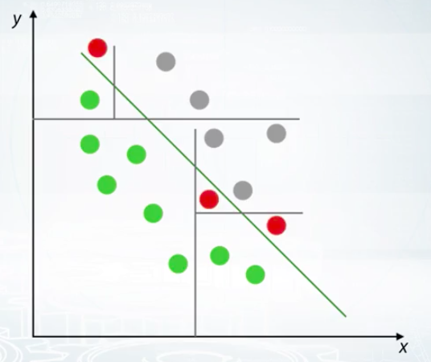

### Abstract
<!-- more -->

#### Platforms for training data science competition
- Kaggle
- DrivenData
- CrowdAnalityx
- CodaLab
- DataSciencChallenge.net
- Datascience.net
- Single-competition sites (KDD, VisDooM)

#### Families of ML algorithm
- Linear model.
  - Intuition: Separate data set into two subspaces by a line or a hyper plane.
  - Examples: Logistic regression, SVM.
  - Pros: Good for sparse and high dimensional data.
  - Cons: Too simple for complex data, e.g. ring shape data set.
  - Impl: scikit learn, vowpal wabbit
  [Explanation/Demonstration of Gradient Boosting](http://arogozhnikov.github.io/2016/06/24/gradient_boosting_explained.html)

- Tree-based model.
  - Intuition: Use divide-and-conquer approach to recur sub-split spaces into sub-spaces. Split space into boxes.
  - Examples: decision tree, random forest, GDBT.
  - Pros: Good for tabular data, many winner take this approach.
  - Cons: Hard to capture linear dependencies since it requires a lot of splits.

  - Impl: scikit learn (general), dmlc xgboost and microsoft/light gbm (faster, higher accuracy)
  [Explanation of Random Forest](http://www.datasciencecentral.com/profiles/blogs/random-forests-explained-intuitively)

- kNN
  - Intuition: Points close to each other are likely to have similar labels.
  - Distance metric: square distance is the easiest one but sometimes this metric cannot capture semantic such as images.
    Hence, feature based on nearest neighbors are often very informative.
  - Impl: scikit learn.
  [Example of kNN](https://www.analyticsvidhya.com/blog/2014/10/introduction-k-neighbours-algorithm-clustering/)

- Neural Networks
  - Intuition: Feed-forward NNs produce smooth non-linear decision boundary.
  - Pros: Good for images, sounds, text, and sequences.
  - Impl: tensorflow, keras, pytorch (recommend)

> *No free lunch theorem: "Here is no method which outperforms all others for all tasks"*  
> Every method relies on some assumptions which relates to the data set.

Conclusion: The most powerful methods are Gradient Boosted Decision Trees and Neural Networks. But other methods should not be underestimate as well.

### Quiz

### Hardware and software
Hardware: 32G ram, 6 cores.
Software: pandas, numpy, matplot etc.

### Todo
1. wait for week 2 eda.
2. some part of week 1 haven't finished.

### Ref
[[1] competitive-data-science](https://www.coursera.org/learn/competitive-data-science/lecture/7I3do/competition-mechanics)
